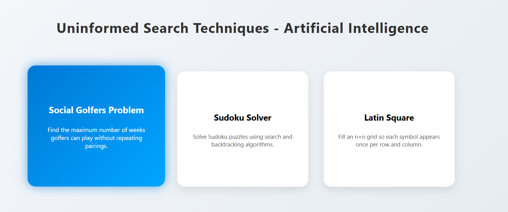
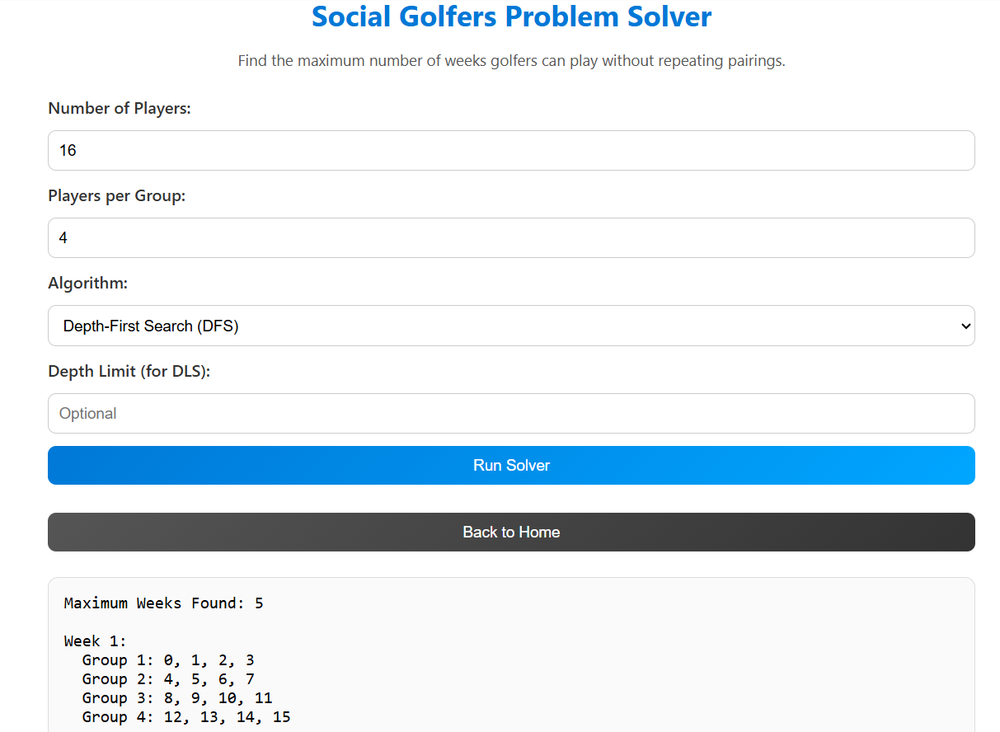
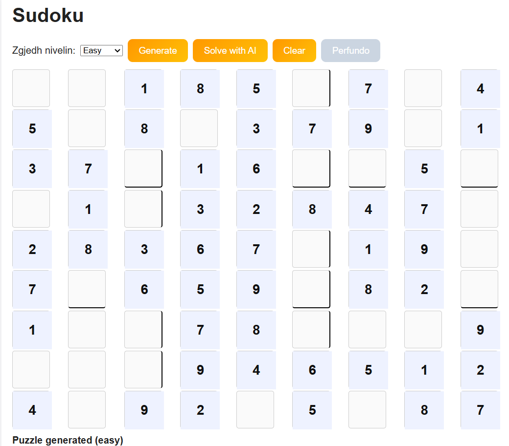
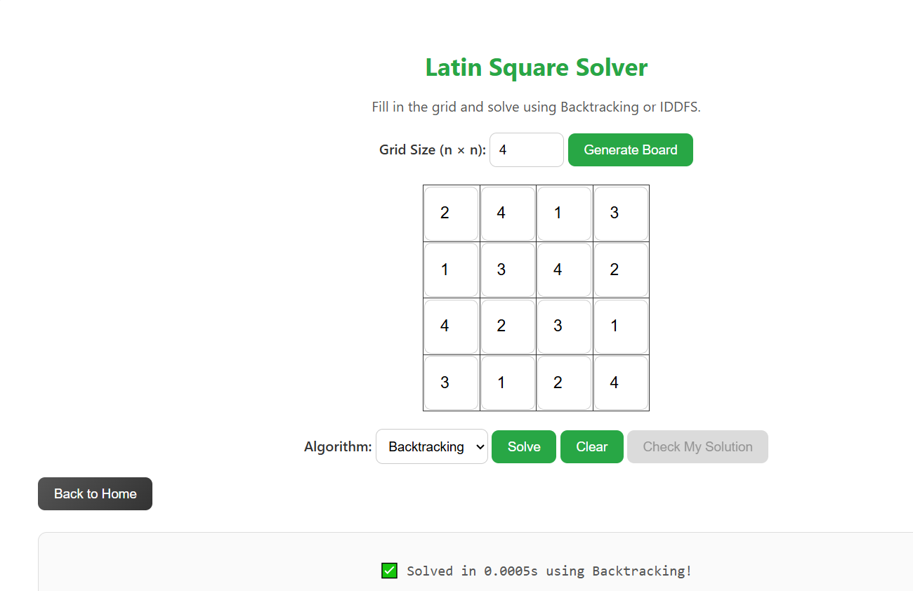

# Teknikat e Painformuara të Kërkimit (Uninformed Search Techniques)

## Introductory Information


**University of Prishtina**  
**Faculty of Computer and Software Engineering**  
Master’s Program in **Computer and Software Engineering**  
Course: **Artificial Intelligence**

## Course Professors

- **Avni Rexhepi**
- **Adrian Ymeri**

## Project Team Members (Group 14)

- **Anjeza Sfishta**
- **Fortesa Cena**
- **Milot Qorrolli**


Ky projekt përfshin implementimin e tri lojërave klasike që modelojnë **probleme kërkimi** në Inteligjencën Artificiale duke përdorur **teknika të painformuara të kërkimit (Uninformed Search Techniques)**.

---

## 🖼️ Pamja e aplikacionit

Pamja fillestare përmban tre butona kryesorë:

- **Social Golfers**
- **Sudoku Solver**
- **Latin Square**

Kur klikohet në secilin buton, hapet loja përkatëse.



---

## 1️⃣ Social Golfers Problem

### Përshkrimi
32 lojtarë golfi ndahen në **8 grupe me nga 4 lojtarë** çdo javë.  
Qëllimi është të planifikohet numri maksimal i javëve në mënyrë që **asnjë çift lojtarësh të mos luajë më shumë se një herë së bashku**.

### Modelimi i problemit
- **Variablat:** pozicionet e lojtarëve në grupe për çdo javë  
- **Domain-i:** {0, 1, 2, …, 31}  
- **Kufizimet:** asnjë çift lojtarësh nuk mund të ndodhë bashkë më shumë se një herë  
- **Qëllimi:** gjenerimi i kombinimeve valide për çdo javë

### Teknikat e përdorura
- **Depth First Search (DFS)** me **Backtracking**  
- **Depth Limited Search (DLS)** me kufizim të thellësisë



---

## 2️⃣ Sudoku Solver

### Përshkrimi
Programi zgjidh një **Sudoku** për nivele **Easy**, **Medium** dhe **Hard**, duke përdorur kërkim të gjerë dhe rikthim prapa.

### Modelimi i problemit
- **Variablat:** qelizat bosh të rrjetës 9×9  
- **Domain-i:** {1, 2, 3, 4, 5, 6, 7, 8, 9}  
- **Kufizimet:** çdo rresht, kolonë dhe bllok 3×3 përmban vlera unike  
- **Qëllimi:** plotësimi i rrjetës sipas rregullave të Sudoku

### Teknikat e përdorura
- **Breadth First Search (BFS)** me **Backtracking**



---

## 3️⃣ Latin Square

### Përshkrimi
Krijon një **matricë n×n** ku çdo numër nga 1 në n shfaqet **vetëm një herë në çdo rresht dhe kolonë**.

### Modelimi i problemit
- **Variablat:** qelizat e matricës  
- **Domain-i:** {1, 2, …, n}  
- **Kufizimet:** pa përsëritje në rreshta ose kolona  
- **Qëllimi:** gjenerimi i një matrice latine valide

### Teknikat e përdorura
- **Iterative Deepening Depth First Search (IDDFS)**  
- **Backtracking**



---

## ⚙️ Si të ekzekutohet projekti

1. Klono repozitorin:
   ```bash
   git clone https://github.com/AnjezaSfishta/AI_Challenges_Task1-.git
   cd backend

   python app.py

